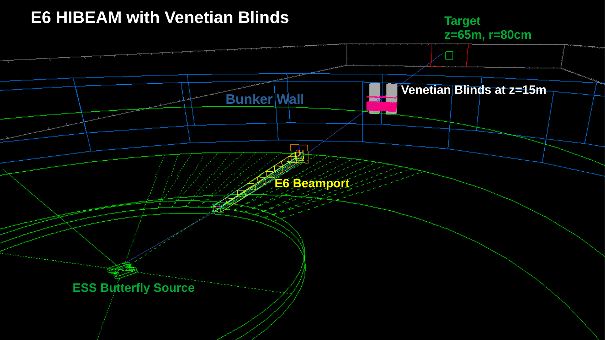
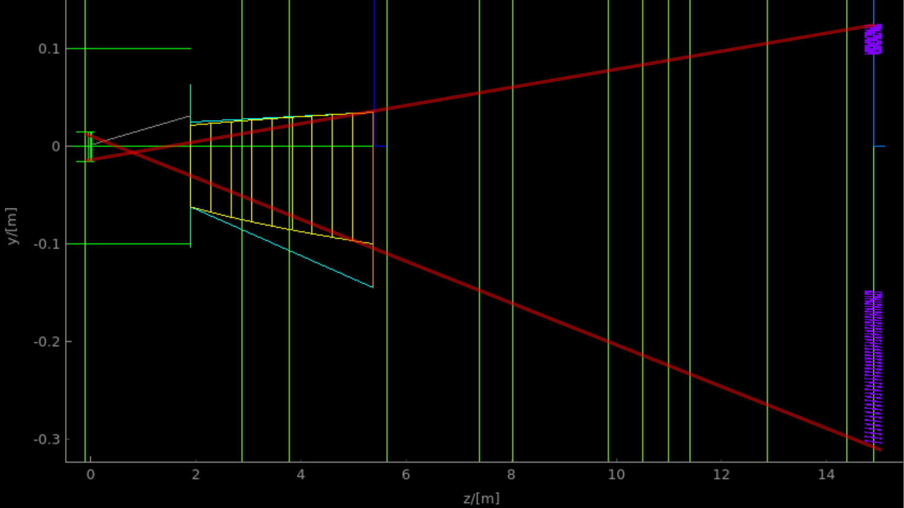
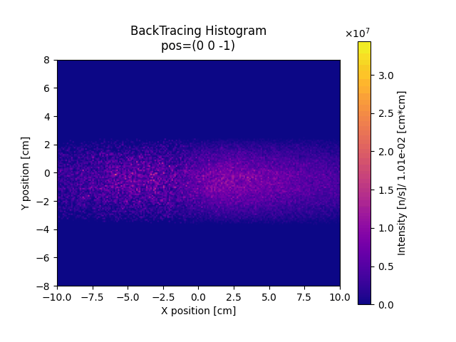
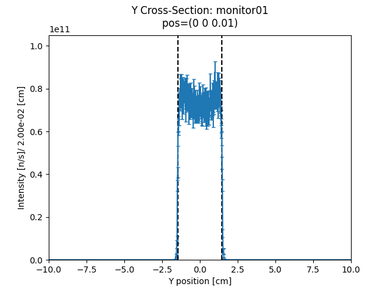

# HIBEAM_mcstas
Beam design and component simulation for HIBEAM nnbar experiment at ESS

## Table of Contents
1. Description   
	1.1 HIBEAM and Venetian Blinds   
	1.2 Features    
2. Installation  
3. Usage  
4. Author(s) and Acknowledgement  
5. References  

## 1 Description
This repository documents simulation of Venetian Blinds configurations for optimizing their use in the HIBEAM nnbar experiment at ESS. `hibeam.instr` and engineering constraints for monolith guide specified by .off files are generated by McStasScript with constraints found in [1] maintained by ESS collaborators.  
Custom component `Venbla.comp` was written to optimize integration of building and simulation of Venetian blinds, but does not export to .off file format. `Venbla_to_off.py` calculates venetian blinds geometry in the same way, but exports it to .off file format to be simulated using the standard `guide_anyshape.comp` McStas component.   

### 1.1 HIBEAM and Venetian Blinds 

#### 1.1.1 Origin of Differential Reflecting Concept 
Custom component: The so called "Venetian Blinds" differential neutron reflector is modeled after "Nested Reflector" concept in [X-Ray astronomy](https://imagine.gsfc.nasa.gov/educators/programs/xmm/mission/mirrors.html)
 - neutrons reflected off mirrors focused towards center of detector
 - gap in center of blade array to allow undeflected neutrons to pass through

#### 1.1.2 Naming convention
Among ESS researchers, this component is commonly referred to as a "nested reflector" after the nested reflectors of X Ray astronomy.
As it is a new component, the new name "Venetian blinds" (credit: Yuri Kamyshkov, University of Tennessee-Knoxville) is more fitting because neutron supermirror manufacturing restrictions force this component to have straight blades.
Flat mirror sections mean that the sections are no longer "nested", instead being separated for horizontal and vertical focusing. 
This is akin to the so-called "venetian blinds" one would find on a window, and thus this name is more apt.

#### 1.1.3 Venetian Blinds in HIBEAM Beamline
  
Hibeam optical geometry is roughly summarized by the isometric view above.

<!-- BLADE ANGLE -->
Horizontal blades account for y velocity deviation, and vertical blades account for x velocity deviation. 
Blade angles are given by the formula:  
$$\theta = 0.5 * (atan(y_{blade}/z_{vb}) - atan(y_{blade}/z_{det}))$$  
With $y_{blade}$ being the y displacement of the blade, $z_{vb}$ being the z position of venetian blinds in relation to the source, and $z_{det}$ being the z distance between the venetian blinds and the detector.
With this, a ray from the center of the source to the center of the blade will be reflected directly to the center of the target.  

<!-- COVERING FULL SOLID ANGLE -->
The blades are arranged such that rays passing through the venetian blinds geometry will intersect with exactly 1 blade, so that there are no rays which are covered twice and no gaps in between blades for a pointlike source.
To accomplish this, the generation of Venetian Blinds geometry starts with the top blade whose angle is defined by the above formula, and finds the ray which intersects the bottom edge cfarthest from the source.
The ray is then propagated to the plane $z = z_{det} - length/2$, where length is the z extent of the blades, to give the top edge of the next blade.  

<!-- ACCOUNTING FOR THICKNESS OF BLADES -->
This restriction makes it difficult to account for the thickness of the blades (between 0.5-2.0 mm) because it is hard to solve for the bottom center point which would give the correct reflection given only the top left edge, and a recursive method is required to approximate the correct blade angle:
$$y_{tmp} = y_{rc}$$  
$$\delta = 0.5 * (atan(z_{det}/ y_{rc}) - atan(z_{vb}/ (y_{rc}/ y_{src})))$$  
$$y_{rc} = y_{0} + tan(\delta) * length/2$$  
While $10^{-5} \leq |y_{tmp}$ - $y_{rc})|$  
Where $y_{tmp}$ is a placeholder for the previous y, $y_{rc}$ is the center of reflection, $y_{0}$ is the top left of the blade (found in the process of covering the full solid angle), $z_{det}$ is the z distance between the detector and the venetian blinds, and $y_{src}$ is the y center of the source.

<!-- TARGETED Y REFLECTION -->
In the case where the target is displaced in (x,y) relative to the source (such as when gravity is non-negligible), Venetian blinds can be made to divert the beam toward this new target position.
All angles can be shifted by the same $\delta_{\theta}$ to achieve the desired result, as $\delta_{\theta}$ has only minimal variation along y for horizontal venetian blinds:
$$\delta_{\theta} = 0.5 * (atan(y_{rc}/ z_{det}) - atan((y_{rc} - y_{det})/ z_{det}))$$  
Where $y_{rc}$ is the center of reflection (important in accounting for thickness of blades), $y_{det}$ is the y displacement of the target relative to the source, and $z_{det}$ is the z position of the target.

  
Side view of the Elliptic monolith guide (yellow) and Vertically reflecting venetian blinds (purple) with cutouts to select only flux that would have been lost.
Venetian blinds model ([Desmos](https://www.desmos.com/calculator/ehkfioczjt))

HIBEAM experiment is meant to improve upon 1991 (published 1994) ILL nnbar oscillation experiment and conduct world leading search for nn' oscillation dark matter theory.

### 1.2 Features

Using the results of this simulation, tracks were backpropagated to find optimal source position and produce the following visualizations of beam profile evolution:

`Venbla.comp` is a novel McStas component offering a simulation of Venetian blinds modifiable directly in .instr files, but it seems to have a problem handling reflections on the corners of blades.  
`Venbla_to_off.py` uses the same code to generate the geometry of venetian blinds, but exports to .off file format for use with the `guide_anyshape` component in McStas.

## 2 Installation

## 3 Usage
 1. Find the ranges which will collect otherwise lost neutron flux with `calc_vb_ranges.py`.
 2. Generate venetian blinds with the correct geometry using the parameters of the instrument and the ranges calculated in 1.
 3. Use the `guide_anyshape` component to insert the venetian blinds .off geometry into the .instr file
 4. Run simulations to optimize figure of merit ($N * TOF^2$ for nnbar oscillation experiment) adjusting venetian blinds parameters.

## 4 Authors and Acknowledgement
James M. Rogers, University of Tennessee - Knoxville  
contact: jroger87@vols.utk.edu  

The author would like to acknowledge a similar implementation of the venetian blinds (nested reflector) geometry by Udo Fridman-Gayer at ([Nested Optics](https://git.esss.dk/udo.friman-gayer/nes_optics_ted))   

## 5 References
[1] Udo Fridman-Gayer's work on monolith geometry at ([Monolith Geometry](https://git.esss.dk/udo.friman-gayer/hibeam_mcstas))

## License  
Under the GNU AFFERO GENERAL PUBLIC LICENSE  

## Project Status  
Currently in progress as of 9-24-23  
